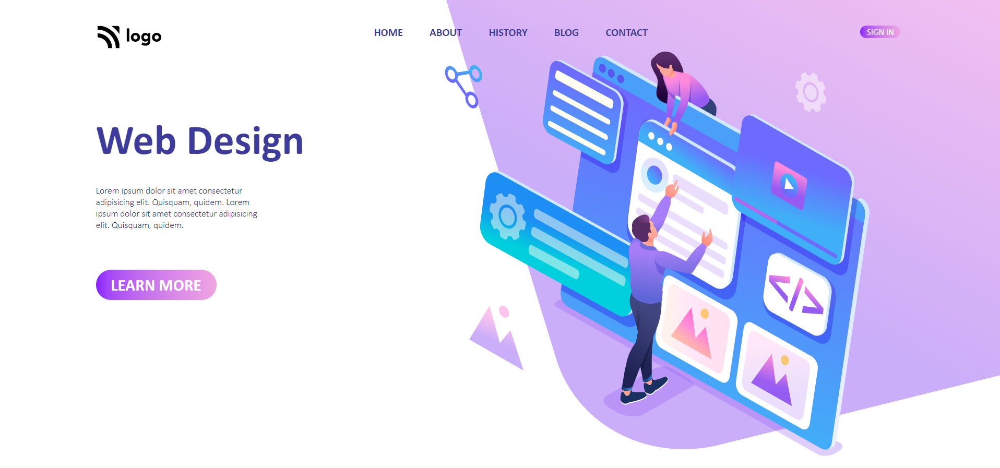

# Mohan Chindam

- Refined my CSS background property styling skills.
- Used properties like flexbox, position, linear-gradient, etc..,
- Polished my positioning skills and color selection skills.
- Positioning of elements took less time in this project because of flexbox.
- Took nearly four hours to complete this project.
- Took 60% of the time to do something, which didn't give me satisfactory background image shaping results. But finally found out that the background image was given in a required shape and just applied some properties to it to get the required result.

- Below image shows the preview of the project:

I deployed the project on **Netlify**:
- You can preview the project here, [**Design Landing Page**]()

